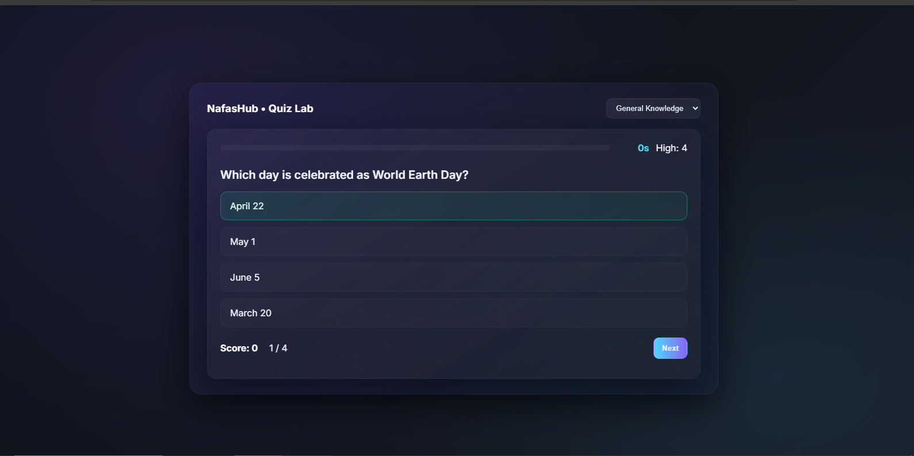

# Quiz App


---

## 📚 Quiz Lab — Interactive Quiz Application

A clean, fast, and interactive quiz application built with HTML, CSS, and JavaScript.
Users can select categories, answer questions under a timer, and get instant scores.

---

## 🔗 Live Demo:
👉 https://faaiz1505.github.io/Quiz_App/

---

## 📌 Table of Contents

Preview

Features

Tech Stack

How It Works

Project Structure

Run Locally

Improvements

Contact

---

## 🖼️ Preview



---

## 🚀 Features

* Multiple quiz categories
* Clean and responsive UI
* Timer countdown for each quiz
* Score calculation + result summary
* Retry quiz or switch category
* Simple, fast, and works on all browsers
* No external libraries required

---

## 🧰 Tech Stack

* Technology	Purpose
* HTML	Structure
* CSS	Styling
* JavaScript	Logic & Quiz Engine

---

## 🎯 How It Works

* Open the app
* Choose a category
* Click Start
* Timer begins
* Select answers
* End screen shows: score, percentage, and options to retry

---

## 📦 Project Structure

counter-app/
├── index.html     ← main HTML file  
├── style.css      ← styling and Animation  
├── script.js      ← JavaScript logic Quiz 
├── assets/        ← (optional) images or icons if you add any  
└── README.md      ← this file  

---

💻 Run Locally
## Installation / Running Locally
1. Clone the repository:
   ```bash
   git clone https://github.com/faaiz1505/Quiz_App.git
   
2. Enter folder
   ```bash
   cd Quiz_App
  
3. Open index.html in browser

No installation required.

## 🛠️ Suggestions & Future Improvements

* Add sound effects

* Add localStorage high score

* Add API-based questions

* Add dark/light mode

* Add leaderboard system

## 📞 Contact

I’m Nasirudeen Faaiz (NafasHub). Need help, want a custom design, or want to hire me?

Check out my other projects or contact me for feedback!

GitHub: https://github.com/Faaiz1505

Email: [nasirudeenfaaiz755@gmail.com]

Whatsapp: [Chat with me](https://wa.me/2348012345678?text=Hello!%20My%20name%20is%20____________.%20I%20want%20to%20talk%20about%20_________________________.)
